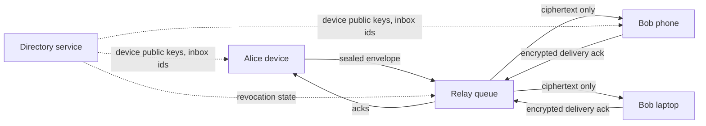

# Resilient Messenger Protocol

[](https://github.com/vaka47/resilient-messenger-protocol/actions/workflows/ci.yml)
[](LICENSE)

Prototype of a server-light, local-first messenger protocol for unreliable or hostile networks.

The project explores a practical question: what should a messenger do when normal internet delivery is degraded, blocked, delayed, or too expensive to centralize?

## Highlights

- Transport-agnostic encrypted envelopes.
- File-backed directory and relay server.
- Local device identity with linked devices.
- Multi-device recipient fanout.
- Delivery acknowledgements back to the sender.
- Prototype per-device ratcheted message keys.
- Device fingerprints for manual verification.
- Device revocation enforcement.
- Local append-only event history.
- CLI demo and end-to-end tests.
- Explicit security model and production crypto roadmap.

## Why It Exists

Most messengers assume the network is usually available and the provider can afford large centralized storage. This prototype takes a different direction:

- clients own message history;
- relays store only encrypted queue items with bounded retention;
- the protocol can later route over multiple transports;
- server cost should scale closer to temporary delivery load than permanent cloud history.

## Architecture



Detailed docs:

- [Protocol v1](docs/protocol-v1.md)
- [Architecture](docs/architecture.md)
- [Security model](docs/security-model.md)
- [Crypto roadmap](docs/crypto-roadmap.md)
- [Group security boundary](docs/group-security.md)
- [Audit readiness](docs/audit-readiness.md)
- [Demo script](docs/demo.md)
- [Roadmap](docs/roadmap.md)
- [Commercialization paths](docs/commercialization.md)

## Current Scope

This is a protocol/backend prototype, not a production mobile app.

Implemented:

- local device identity;
- linked devices for one account;
- directory registration;
- relay queue delivery with encrypted delivery ack;
- signed and encrypted `1:1` envelopes;
- prototype ratcheted message-key chains for text payloads;
- device fingerprint verification helpers;
- revoked-device filtering and relay queue purge;
- multi-device recipient fanout;
- local event history on each device;
- end-to-end tests for send, receive, decrypt, ack, and status update.

Not implemented yet:

- production Double Ratchet sessions;
- MLS group encryption;
- nearby Bluetooth/Wi-Fi transport;
- Android/iOS client;
- push notifications;
- device recovery and revocation UX.

## Security Position

The relay server must never receive plaintext messages or private keys. In the current prototype, message content is sealed on the sender device and can only be opened with the recipient device private key.

Important limitation: the current envelope crypto is a prototype layer built from standard Node.js primitives (`X25519`, `HKDF-SHA256`, `AES-256-GCM`, `Ed25519`). It demonstrates the end-to-end boundary but is not yet a full production E2EE messenger design.

Message payloads now use a prototype per-device ratchet chain, so each message advances a chain key. This improves the security model compared with a static message envelope, but it is still not a full Signal Double Ratchet because it does not yet implement DH ratchet turns, skipped-message keys, prekeys, or post-compromise recovery.

For production, the plan is:

- `1:1`: X3DH/PQXDH-style session setup plus Double Ratchet.
- `groups`: MLS-style group state.
- `post-compromise recovery`: ratcheted message keys.
- `metadata minimization`: rotating inbox ids and bounded relay retention.

See [Security model](docs/security-model.md) and [Crypto roadmap](docs/crypto-roadmap.md).

## Quickstart

Run tests:

```bash
npm test
```

Start the relay and directory server:

```bash
npm run server -- --port 8080
```

Initialize and register Alice:

```bash
node src/cli.js init --state-dir ./state/alice --name Alice
node src/cli.js register --state-dir ./state/alice --base-url http://127.0.0.1:8080
```

Initialize and register Bob:

```bash
node src/cli.js init --state-dir ./state/bob --name Bob
node src/cli.js register --state-dir ./state/bob --base-url http://127.0.0.1:8080
```

Add Bob's second device:

```bash
node src/cli.js link-device --from-state-dir ./state/bob --state-dir ./state/bob-laptop
node src/cli.js register --state-dir ./state/bob-laptop --base-url http://127.0.0.1:8080
```

Send a message from Alice to Bob:

```bash
node src/cli.js send --state-dir ./state/alice --base-url http://127.0.0.1:8080 --to BOB_ACCOUNT_ID --text "hello"
```

Sync Bob's devices:

```bash
node src/cli.js sync --state-dir ./state/bob --base-url http://127.0.0.1:8080
node src/cli.js sync --state-dir ./state/bob-laptop --base-url http://127.0.0.1:8080
```

Sync Alice to receive delivery acknowledgements:

```bash
node src/cli.js sync --state-dir ./state/alice --base-url http://127.0.0.1:8080
node src/cli.js inbox --state-dir ./state/alice
```

Show a cached device fingerprint:

```bash
node src/cli.js fingerprint --state-dir ./state/alice --account-id BOB_ACCOUNT_ID --device-id BOB_DEVICE_ID
```

Verify the device after comparing the fingerprint out-of-band:

```bash
node src/cli.js verify-device --state-dir ./state/alice --account-id BOB_ACCOUNT_ID --device-id BOB_DEVICE_ID --fingerprint "FINGERPRINT"
```

Revoke a linked device:

```bash
node src/cli.js revoke-device --state-dir ./state/bob --base-url http://127.0.0.1:8080 --device-id BOB_LAPTOP_DEVICE_ID
```

`init` refuses to overwrite existing state unless `--force` is passed.

## Project Structure

```text
src/
  client/       local state, crypto, ratchet, identity, workflow, HTTP API client
  server/       directory and relay server
  constants.js  protocol constants
  envelope.js   transport-agnostic envelope model
  policy.js     transport ranking policy
  storage.js    relay/media replication helpers
test/           protocol, crypto, and e2e tests
docs/           protocol, architecture, security, roadmap, commercialization
```

## Portfolio Notes

This repository is designed to show:

- distributed systems thinking;
- security boundary design;
- server-light architecture;
- testable protocol modeling;
- product strategy around resilience and cost.

## License

MIT
