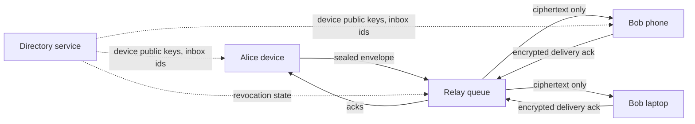

# Resilient Messenger Protocol

[](https://github.com/vaka47/resilient-messenger-protocol/actions/workflows/ci.yml)
[](LICENSE)

Prototype of a server-light, local-first messenger protocol for unreliable or hostile networks.

The project explores a practical question: what should a messenger do when normal internet delivery is degraded, blocked, delayed, or too expensive to centralize?

## Highlights

- Transport-agnostic encrypted envelopes.
- File-backed directory and relay server.
- QR-only phone onboarding with sponsor approval and a high-entropy invite secret.
- Password-protected account login and linked-device registration.
- Local device identity with linked devices.
- Multi-device recipient fanout.
- Delivery acknowledgements back to the sender.
- Prototype per-device ratcheted message keys.
- Signed prekey and one-time prekey bootstrap.
- DH-ratchet turns for replies.
- Skipped-message key cache for limited out-of-order delivery.
- Verifiable append-only key transparency log for device lifecycle changes.
- Encrypted local recovery bundle for account/device key material.
- Device fingerprints for manual verification.
- Device revocation enforcement.
- Relay-side sender, recipient, and addressed-inbox validation.
- Local append-only event history.
- CLI demo and end-to-end tests.
- Explicit security model and production crypto roadmap.

## Why It Exists

Most messengers assume the network is usually available and the provider can afford large centralized storage. This prototype takes a different direction:

- clients own message history;
- relays store only encrypted queue items with bounded retention;
- the protocol can later route over multiple transports;
- server cost should scale closer to temporary delivery load than permanent cloud history.

## Architecture



Detailed docs:

- [Protocol v1](docs/protocol-v1.md)
- [Architecture](docs/architecture.md)
- [Account and invite model](docs/account-model.md)
- [Security model](docs/security-model.md)
- [Mobile runbook](docs/mobile-runbook.md)
- [Cryptographic standards plan](docs/crypto-standards.md)
- [Crypto roadmap](docs/crypto-roadmap.md)
- [Group security boundary](docs/group-security.md)
- [Production readiness](docs/production-readiness.md)
- [Audit readiness](docs/audit-readiness.md)
- [Demo script](docs/demo.md)
- [Roadmap](docs/roadmap.md)
- [Commercialization paths](docs/commercialization.md)

## Current Scope

This is a protocol/backend prototype, not a production mobile app.

Implemented:

- local device identity;
- linked devices for one account;
- owner bootstrap, sponsor-created QR invites, phone binding, and referral-chain completion;
- password reset through a replacement QR invite from the original inviter;
- password verification for login and linked-device registration;
- directory registration that publishes only public device and prekey material;
- relay queue delivery with encrypted delivery ack;
- signed and encrypted `1:1` envelopes;
- signed prekey and one-time prekey directory bootstrap;
- prototype DH-ratcheted message-key chains for text payloads;
- skipped-message key handling for limited out-of-order delivery;
- append-only key transparency log for registration and revocation events;
- encrypted recovery bundle export/restore for local device key material;
- device fingerprint verification helpers;
- revoked-device filtering and relay queue purge;
- strict relay checks that reject unknown senders, unknown recipients, revoked devices, and inboxes not addressed by the envelope;
- multi-device recipient fanout;
- local event history on each device;
- end-to-end tests for onboarding, password failures, send, receive, decrypt, ack, revocation, and status update.

Not implemented yet:

- production Double Ratchet sessions;
- MLS group encryption;
- nearby Bluetooth/Wi-Fi transport;
- production Android/iOS distributable clients;
- push notifications;
- hardened device recovery and revocation UX.

## Security Position

The relay server must never receive plaintext messages or private keys. In the current prototype, message content is sealed on the sender device and can only be opened with the recipient device private key.

Important limitation: the current envelope crypto is a prototype layer built from standard Node.js primitives (`X25519`, `HKDF-SHA256`, `AES-256-GCM`, `Ed25519`). It demonstrates the end-to-end boundary but is not yet a full production E2EE messenger design.

Message payloads now use a prototype per-device DH ratchet. It includes signed prekeys, one-time prekey consumption, chain-key advancement, DH-ratchet turns for replies, and skipped-message key handling. Device lifecycle changes are recorded in a verifiable hash-chain transparency log, and local key recovery is encrypted client-side. This improves the security model compared with a static message envelope, but it is still not a full production E2EE stack because it does not yet implement X3DH/PQXDH exactly, the full Double Ratchet lifecycle, MLS, hardened recovery, or independent cryptographic audit.

For production, the plan is:

- `1:1`: X3DH/PQXDH-style session setup plus Double Ratchet.
- `groups`: MLS-style group state.
- `post-compromise recovery`: ratcheted message keys.
- `metadata minimization`: rotating inbox ids and bounded relay retention.
- `trust visibility`: key transparency with client monitoring and consistency proofs.

See [Security model](docs/security-model.md) and [Crypto roadmap](docs/crypto-roadmap.md).

## Quickstart

Run tests:

```bash
npm test
```

Start the relay and directory server:

```bash
npm run server -- --port 8080
```

Initialize Alice and bootstrap the first owner account:

```bash
node src/cli.js init --state-dir ./state/alice --name Alice
node src/cli.js bootstrap-owner --state-dir ./state/alice --base-url http://127.0.0.1:8080 --phone +10000000001 --password "alice-password-123" --password-confirm "alice-password-123"
```

Alice creates a QR invite for Bob's phone number. The returned `qrPayloadB64` is what the mobile app should render as a QR code:

```bash
node src/cli.js init --state-dir ./state/bob --name Bob
node src/cli.js create-qr-invite --state-dir ./state/alice --base-url http://127.0.0.1:8080 --phone +10000000002
```

Bob scans the QR code and completes registration with the exact phone number and confirmed password:

```bash
node src/cli.js complete-registration --state-dir ./state/bob --base-url http://127.0.0.1:8080 --request-id REQUEST_ID --qr-token QR_TOKEN --phone +10000000002 --password "bob-password-123" --password-confirm "bob-password-123"
```

Add Bob's second device:

```bash
node src/cli.js link-device --from-state-dir ./state/bob --state-dir ./state/bob-laptop
node src/cli.js register --state-dir ./state/bob-laptop --base-url http://127.0.0.1:8080 --password "bob-password-123"
```

Bob can now sponsor the next user, for example Carol:

```bash
node src/cli.js init --state-dir ./state/carol --name Carol
node src/cli.js create-qr-invite --state-dir ./state/bob --base-url http://127.0.0.1:8080 --phone +10000000003
node src/cli.js complete-registration --state-dir ./state/carol --base-url http://127.0.0.1:8080 --request-id CAROL_REQUEST_ID --qr-token CAROL_QR_TOKEN --phone +10000000003 --password "carol-password-123" --password-confirm "carol-password-123"
```

Login check after logout:

```bash
node src/cli.js login --base-url http://127.0.0.1:8080 --phone +10000000002 --password "bob-password-123"
```

Forgotten password flow:

```bash
node src/cli.js create-qr-invite --state-dir ./state/alice --base-url http://127.0.0.1:8080 --phone +10000000002
node src/cli.js complete-registration --state-dir ./state/bob-restored --base-url http://127.0.0.1:8080 --request-id RESET_REQUEST_ID --qr-token RESET_QR_TOKEN --phone +10000000002 --password "new-bob-password-123" --password-confirm "new-bob-password-123"
```

The reset QR replaces older active invites for that phone and keeps Bob's existing account id/referral link. Local chat history remains local to devices unless separately backed up.

Send a message from Alice to Bob:

```bash
node src/cli.js send --state-dir ./state/alice --base-url http://127.0.0.1:8080 --to BOB_ACCOUNT_ID --text "hello"
```

Sync Bob's devices:

```bash
node src/cli.js sync --state-dir ./state/bob --base-url http://127.0.0.1:8080
node src/cli.js sync --state-dir ./state/bob-laptop --base-url http://127.0.0.1:8080
```

Sync Alice to receive delivery acknowledgements:

```bash
node src/cli.js sync --state-dir ./state/alice --base-url http://127.0.0.1:8080
node src/cli.js inbox --state-dir ./state/alice
```

Show a cached device fingerprint:

```bash
node src/cli.js fingerprint --state-dir ./state/alice --account-id BOB_ACCOUNT_ID --device-id BOB_DEVICE_ID
```

Verify the device after comparing the fingerprint out-of-band:

```bash
node src/cli.js verify-device --state-dir ./state/alice --account-id BOB_ACCOUNT_ID --device-id BOB_DEVICE_ID --fingerprint "FINGERPRINT"
```

Revoke a linked device:

```bash
node src/cli.js revoke-device --state-dir ./state/bob --base-url http://127.0.0.1:8080 --device-id BOB_LAPTOP_DEVICE_ID
```

Inspect the key transparency log:

```bash
node src/cli.js transparency --base-url http://127.0.0.1:8080
```

Export and restore an encrypted recovery bundle:

```bash
node src/cli.js recovery-export --state-dir ./state/alice --out ./state/alice.recovery.json --passphrase "correct horse battery staple"
node src/cli.js recovery-restore --bundle ./state/alice.recovery.json --state-dir ./state/alice-restored --passphrase "correct horse battery staple"
```

`init` refuses to overwrite existing state unless `--force` is passed.

## Project Structure

```text
src/
  client/       local state, crypto, ratchet, recovery, identity, workflow, HTTP API client
  server/       directory, relay, and transparency log server
  constants.js  protocol constants
  envelope.js   transport-agnostic envelope model
  policy.js     transport ranking policy
  storage.js    relay/media replication helpers
test/           protocol, crypto, and e2e tests
docs/           protocol, architecture, security, roadmap, commercialization
```

## Portfolio Notes

This repository is designed to show:

- distributed systems thinking;
- security boundary design;
- strict account onboarding and delivery authorization;
- server-light architecture;
- testable protocol modeling;
- product strategy around resilience and cost.

## License

MIT
