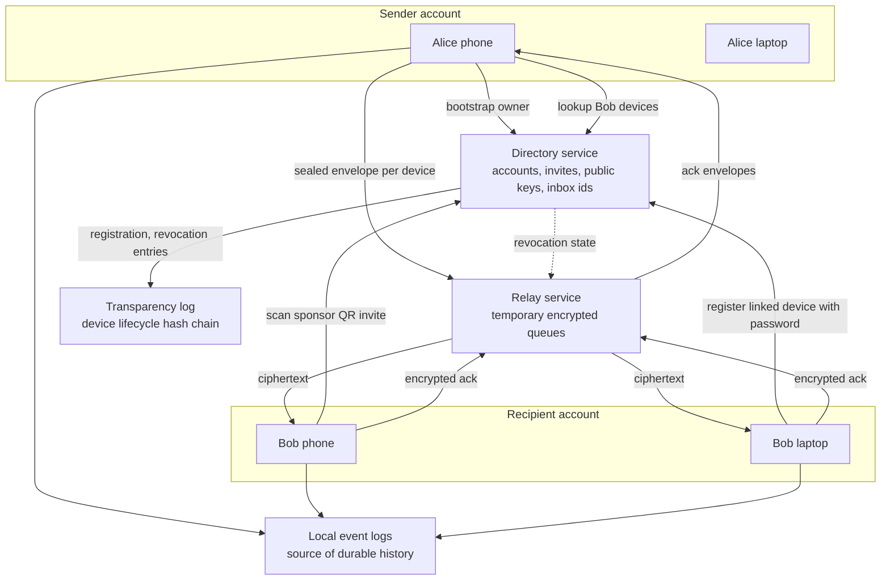

# Architecture

## Design Goal

The system is server-light, not serverless. It keeps central infrastructure small by moving durable message history to user devices and limiting relays to encrypted queue storage.

## Components

## Message Flow

1. Sender looks up recipient devices in the directory.
2. Sender seals a separate encrypted envelope for each recipient device.
3. Relay stores only ciphertext and queue metadata.
4. Recipient devices pull, decrypt locally, append to local history, and ack.
5. Sender pulls encrypted ack envelopes and updates delivery state.

## Server Responsibilities

Directory service:

- account records;
- unique phone index;
- invite requests and sponsor approvals;
- password hashes for login and linked-device registration;
- device descriptors;
- public encryption and signing keys;
- signed prekey bundles;
- one-time prekey public bundles with consumption;
- inbox identifiers.
- device revocation state;
- key transparency entries for registration and revocation.

Relay service:

- encrypted queue items;
- expiry timestamps;
- delivery acknowledgement removal.
- revoked inbox purge.
- active sender and addressed recipient validation.

The server must not store:

- plaintext messages;
- private keys;
- permanent chat history.
- private recovery passphrases or unencrypted recovery bundles.
- password plaintext.

## Scaling Model

Durable storage lives mostly on devices. Server cost is dominated by:

- directory records;
- temporary queue storage;
- short-lived delivery traffic;
- optional future media escrow.
- append-only transparency metadata.

This is the core infrastructure advantage over a cloud-history messenger.
